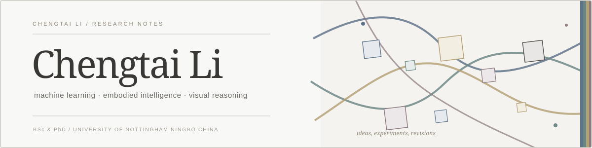

  

  <a href="https://github.com/wozhendetainanle?tab=repositories">repositories</a>
  &nbsp;·&nbsp;
  <a href="https://github.com/wozhendetainanle/Daily-Arxiv">reading archive</a>
  &nbsp;·&nbsp;
  <a href="https://github.com/wozhendetainanle">github</a>

## About

I'm **Chengtai Li**. I earned both my **BSc** and **PhD** from the **University of Nottingham Ningbo China (UNNC)**.

My public work spans machine learning, compositional and visual reasoning, and lightweight tools for research.

  
  
  

  Thanks for stopping by.

